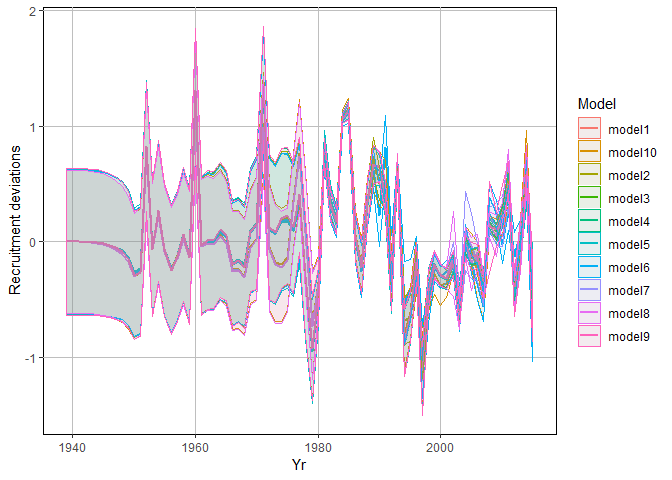
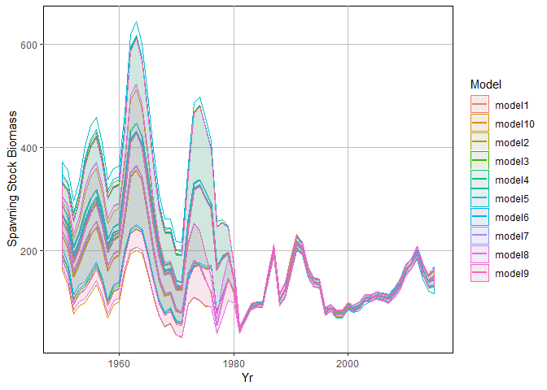
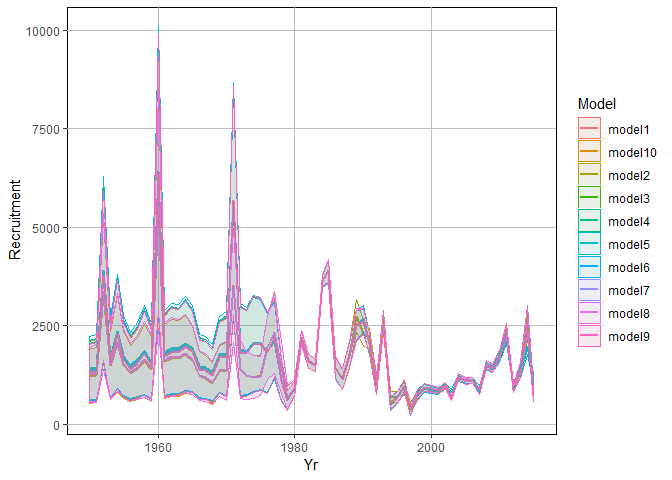

How to Compare Multiple Stock Synthesis Models
================
Stock Assessment Group FWRI, Liz Herdter

Main Objectives
===============

1.  Compare multiple Stock Synthesis models

All of these functions are detailed in the r4ss [vignette.](https://cran.r-project.org/web/packages/r4ss/r4ss.pdf)

Start Here
==========

Load r4ss library
-----------------

``` r
library('r4ss')
library(tidyverse)
library(data.table)
```

Get Models to Compare
---------------------

Here, I'm going to compare 10 different SS models. Each of these models differ in terms of the kind of environmental data included and how each dataset was included (whether by the model method or the data method). This step might take a minute or two depending on how many models you want to compare.

``` r
wd = "T:/Elizabeth Herdter"
model1 <- SS_output(paste(wd, "NE/NEbase", sep="/"),covar=T,cormax=0.5, verbose=FALSE, printstats=FALSE)
model2 <- SS_output(paste(wd, "NE/Data_precip",sep="/"), covar=T,cormax=0.5, verbose=FALSE, printstats=FALSE)
model3 <- SS_output(paste(wd, "NE/Data_riv", sep="/"), covar=T,cormax=0.5, verbose=FALSE, printstats=FALSE)
model4 <- SS_output(paste(wd, "NE/Data_salinity", sep="/"), covar=T,cormax=0.5, verbose=FALSE, printstats=FALSE)
model5 <- SS_output(paste(wd, "NE/Data_temp", sep="/"), covar=T,cormax=0.5, verbose=FALSE, printstats=FALSE)
model6 <- SS_output(paste(wd, "NE/Model_precip", sep="/"), covar=T,cormax=0.5, verbose=FALSE, printstats=FALSE)
model7 <- SS_output(paste(wd, "NE/Model_riv", sep="/"), covar=T,cormax=0.5, verbose=FALSE, printstats=FALSE)
model8 <- SS_output(paste(wd, "NE/Model_salinity", sep="/"), covar=T,cormax=0.5, verbose=FALSE, printstats=FALSE)
model9 <- SS_output(paste(wd, "NE/Model_temp",sep="/"), covar=T,cormax=0.5, verbose=FALSE, printstats=FALSE)
model10 <- SS_output(paste(wd, "NE/Model_z",sep="/"), covar=T,cormax=0.5, verbose=FALSE, printstats=FALSE)
```

Summarize the models
--------------------

Use the `SSsummarize` function to summarize all of the models.

``` r
summary_models <- SSsummarize(list(model1, model2, model3, model4, model5, model6, model7, model8, model9, model10))
```

    ## imodel=1/10,  N active pars=99
    ## imodel=2/10
    ## problem summarizing likelihoods by fleet due to mismatched columns
    ## ,  N active pars=99
    ## imodel=3/10
    ## problem summarizing likelihoods by fleet due to mismatched columns
    ## ,  N active pars=99
    ## imodel=4/10
    ## problem summarizing likelihoods by fleet due to mismatched columns
    ## ,  N active pars=99
    ## imodel=5/10
    ## problem summarizing likelihoods by fleet due to mismatched columns
    ## ,  N active pars=99
    ## imodel=6/10,  N active pars=100
    ## imodel=7/10,  N active pars=100
    ## imodel=8/10,  N active pars=100
    ## imodel=9/10,  N active pars=100
    ## imodel=10/10,  N active pars=100

Define variables of interest.
-----------------------------

Here, make vectors for:
1. the names of your models
2. which derived\_quantities you care about
3. which parameters (point estimates) you care about

``` r
#Names of Models
names <- c('model1', 'model2', 'model3', 'model4', 'model5', 'model6', 'model7', 'model8', 'model9','model10')

#Which derived quantities do you care about?
select_quants <- c( "SSB_Virgin", "SSB_2015", "SPRratio_2013", "SPRratio_2014", "SPRratio_2015", "TotYield_MSY", "Fstd_MSY")

#Which parameters (point estimates) do you care about?
select_params <- c("SR_LN(R0)", "SR_BH_steep")
```

Then use `SStableComparions` to produce a simple table. Give the model numbers names that distinguish them. You can make this anything you want. Just be consistent.

``` r
simple_table <- SStableComparisons(summary_models)
```

    ## running SStableComparisons
    ## name=TOTAL_like: added 1 row
    ## name=Survey_like: added 1 row
    ## name=Length_comp_like: added 1 row
    ## name=Age_comp_like: added 1 row
    ## name=priors_like: added 1 row
    ## name=Size_at_age_like: added 0 rows
    ## name=R0: added 1 row
    ## name=steep: added 1 row
    ## name=NatM: added 0 rows
    ## name=L_at_Amax: added 2 rows
    ## name=VonBert_K: added 2 rows
    ## name=SPB_Virg: added 1 row
    ## name=Bratio_2015: added 1 row
    ## name=SPRratio_2014: added 1 row

``` r
names(simple_table) <- c("NE_Base_index", names)

simple_table
```

    ##             NE_Base_index      model1      model2      model3      model4
    ## 1              TOTAL_like 4428.170000 4430.530000 4426.080000 4424.220000
    ## 2             Survey_like    7.946870   13.001100    8.642110    7.209320
    ## 3        Length_comp_like 3138.070000 3136.620000 3136.650000 3136.310000
    ## 4           Age_comp_like 1089.080000 1090.040000 1089.160000 1089.460000
    ## 5        Parm_priors_like   95.928100   95.352100   95.396900   95.405800
    ## 6             R0_billions    0.001791    0.001899    0.001865    0.001861
    ## 7             SR_BH_steep    0.806621    0.776819    0.786598    0.789242
    ## 8      L_at_Amax_Fem_GP_1   56.000000   56.000000   56.000000   56.000000
    ## 9      L_at_Amax_Mal_GP_1   38.000000   38.000000   38.000000   38.000000
    ## 10     VonBert_K_Fem_GP_1    0.470000    0.470000    0.470000    0.470000
    ## 11     VonBert_K_Mal_GP_1    0.960000    0.960000    0.960000    0.960000
    ## 12 SPB_Virgin_thousand_mt    0.470000    0.498000    0.489000    0.488000
    ## 13            Bratio_2015    0.778090    0.726485    0.746812    0.755877
    ## 14          SPRratio_2014    0.664492    0.664710    0.663358    0.662300
    ##         model5      model6      model7      model8      model9     model10
    ## 1  4430.510000 4423.670000 4428.100000 4428.140000 4425.190000 4428.020000
    ## 2    -5.163600    8.990600    8.052040    8.038850    9.097030    7.720940
    ## 3  3141.710000 3136.210000 3137.970000 3138.010000 3136.090000 3138.190000
    ## 4  1097.860000 1089.470000 1089.190000 1089.140000 1089.130000 1089.130000
    ## 5    96.350100   95.260400   95.935800   95.929000   95.368300   95.956900
    ## 6     0.001985    0.001916    0.001790    0.001791    0.001854    0.001750
    ## 7     0.746735    0.791264    0.807228    0.806933    0.792923    0.806228
    ## 8    56.000000   56.000000   56.000000   56.000000   56.000000   56.000000
    ## 9    38.000000   38.000000   38.000000   38.000000   38.000000   38.000000
    ## 10    0.470000    0.470000    0.470000    0.470000    0.470000    0.470000
    ## 11    0.960000    0.960000    0.960000    0.960000    0.960000    0.960000
    ## 12    0.520000    0.502000    0.469000    0.469000    0.486000    0.459000
    ## 13    0.615239    0.748553    0.780722    0.779819    0.771182    0.796049
    ## 14    0.673738    0.660285    0.664162    0.664296    0.660716    0.664415

Get Data
--------

### Derived quantities

Get derived quantities and associated SD from each model.

``` r
derived_quants <- summary_models$quants
```

``` r
derived_quantsSD <- summary_models$quantsSD
```

### Point Estimates

Get parameters (point estimates) and associated SD from each model.

``` r
parameters <- summary_models$pars
```

``` r
param_sd <- summary_models$parsSD
```

### Recruitment Devs

Get recdevs for each model.

``` r
recdev <- summary_models$recdevs
```

Get recdev SD

``` r
recdevSD <- summary_models$recdevsSD
```

### Log-Likelihood values

Get Log-like values for each model.

``` r
likes <- summary_models$likelihoods
```

If you want the Log-like values by fleet you can specify as such...

``` r
likes_by_fleet <-  summary_models$likelihoods_by_fleet
```

### Make tables

If you want the **derived quantities** to print to a table you can do that here.

``` r
vals <- derived_quants[derived_quants$Label %in% select_quants,]
vals <- vals %>% gather(names, key="Model", value ="Value")

vals_sd <- derived_quantsSD[derived_quantsSD$Label %in% select_quants,]
vals_sd <- vals_sd %>% gather(names, key="Model", value ="Value")

vals$sd <- vals_sd$Value
head(vals)
```

    ##           Label   Yr  Model      Value        sd
    ## 1 SPRratio_2013 2013 model1   0.632290 0.0127652
    ## 2 SPRratio_2014 2014 model1   0.664492 0.0157196
    ## 3 SPRratio_2015 2015 model1   0.392246 0.0241838
    ## 4      Fstd_MSY   NA model1   0.774469 0.1525230
    ## 5  TotYield_MSY   NA model1 141.215000 6.6612000
    ## 6 SPRratio_2013 2013 model2   0.633015 0.0126703

If you want **parameters** to print in a table you can do that here.

``` r
SR <- parameters[parameters$Label %in% select_params,]
SR <- SR %>% gather(names, key="Model", value ="Value")
```

``` r
SR_SD <- param_sd[param_sd$Label %in% select_params,]
SR_SD <- SR_SD %>% gather(names,key="Model", value ="Value")
```

``` r
SR$sd <- SR_SD$Value
SR <- SR %>% select(-recdev)
head(SR)
```

    ##         Label Yr  Model    Value        sd
    ## 1   SR_LN(R0) NA model1 7.490750 0.0674541
    ## 2 SR_BH_steep NA model1 0.806621 0.0432965
    ## 3   SR_LN(R0) NA model2 7.549180 0.0780280
    ## 4 SR_BH_steep NA model2 0.776819 0.0448782
    ## 5   SR_LN(R0) NA model3 7.531280 0.0752156
    ## 6 SR_BH_steep NA model3 0.786598 0.0448549

Then you can add these together to produce a useful table.

``` r
impt_params <- rbind(SR, vals)
head(impt_params)
```

    ##         Label Yr  Model    Value        sd
    ## 1   SR_LN(R0) NA model1 7.490750 0.0674541
    ## 2 SR_BH_steep NA model1 0.806621 0.0432965
    ## 3   SR_LN(R0) NA model2 7.549180 0.0780280
    ## 4 SR_BH_steep NA model2 0.776819 0.0448782
    ## 5   SR_LN(R0) NA model3 7.531280 0.0752156
    ## 6 SR_BH_steep NA model3 0.786598 0.0448549

I like my table in a different format so I will use `dcast` from the **data.table** package.

``` r
impt_params <- dcast(setDT(impt_params), Label~Model, value.var = c("Value", "sd"))
head(impt_params)
```

    ##            Label Value_model1 Value_model10 Value_model2 Value_model3
    ## 1:      Fstd_MSY     0.774469      0.773012     0.676699     0.707047
    ## 2: SPRratio_2013     0.632290      0.632147     0.633015     0.631355
    ## 3: SPRratio_2014     0.664492      0.664415     0.664710     0.663358
    ## 4: SPRratio_2015     0.392246      0.392337     0.393337     0.391976
    ## 5:   SR_BH_steep     0.806621      0.806228     0.776819     0.786598
    ## 6:     SR_LN(R0)     7.490750      7.467490     7.549180     7.531280
    ##    Value_model4 Value_model5 Value_model6 Value_model7 Value_model8
    ## 1:     0.715487     0.592315     0.722043     0.776584     0.775565
    ## 2:     0.630457     0.645454     0.628462     0.632078     0.632199
    ## 3:     0.662300     0.673738     0.660285     0.664162     0.664296
    ## 4:     0.390048     0.415309     0.386181     0.391669     0.391804
    ## 5:     0.789242     0.746735     0.791264     0.807228     0.806933
    ## 6:     7.528850     7.593130     7.557820     7.490070     7.490550
    ##    Value_model9 sd_model1 sd_model10 sd_model2 sd_model3 sd_model4
    ## 1:     0.727555 0.1525230  0.1526350 0.1349000 0.1421510 0.1436970
    ## 2:     0.629219 0.0127652  0.0127774 0.0126703 0.0128319 0.0129130
    ## 3:     0.660716 0.0157196  0.0157308 0.0155477 0.0157569 0.0158764
    ## 4:     0.386771 0.0241838  0.0241963 0.0237375 0.0240452 0.0241498
    ## 5:     0.792923 0.0432965  0.0434285 0.0448782 0.0448549 0.0447084
    ## 6:     7.525010 0.0674541  0.0777370 0.0780280 0.0752156 0.0743284
    ##    sd_model5 sd_model6 sd_model7 sd_model8 sd_model9
    ## 1: 0.1072450 0.1446110 0.1528020 0.1526890 0.1461500
    ## 2: 0.0117005 0.0130871 0.0127995 0.0127824 0.0130478
    ## 3: 0.0140676 0.0161016 0.0157745 0.0157566 0.0160730
    ## 4: 0.0214167 0.0242919 0.0242386 0.0242505 0.0243101
    ## 5: 0.0420165 0.0445106 0.0432591 0.0432816 0.0445725
    ## 6: 0.0854717 0.0785860 0.0672562 0.0673420 0.0731300

Visualize some results
----------------------

### Default Plots

You can compare the models with the default r4ss plots. Importantly, these will print out as multiple plots that you will have to click through. They are not included in the output here.

``` r
SSplotComparisons(summary_models)
```

### Customizable Plots

I don't like the default r4ss plots so I will make my own.

#### Recruitment Deviations

We already got the recdev data but we still need to go through the steps above in the *Make tables* section to reformat the data.

``` r
recdev_gather <- recdev %>% gather(names, key="Model", value ="recdev")
recdevSD_gather <- recdevSD %>% gather(names, key="Model", value ="SD")
recdev_gather$SD <- recdevSD_gather$SD
names(recdev_gather)[1] <- "Label"
recdev_gather$Label <- "Recruitment_Devs "
```

Then plot it.

``` r
ggplot(recdev_gather, aes(x=Yr, y=recdev, color=Model)) +geom_line(size=1)+
  geom_ribbon(aes(ymin=recdev-SD, ymax=recdev+SD, fill=Model), alpha=0.05)+
  ylab("Recruitment deviations")+
  theme(panel.grid.major=element_line(color="grey"), panel.grid.minor=element_blank(),                      
        panel.background=element_rect(fill='white', colour='black'))
```



#### Spawning stock biomass

We haven't explicity declared it yet so do that first.

``` r
SSB <- derived_quants[grep("SPB_([0-9])", derived_quants$Label), ]
SSB_SD <- derived_quantsSD[grep("SPB_([0-9])", derived_quantsSD$Label), ]
```

Now, reformat it.

``` r
SSB_gather <- SSB %>% gather(names, key="Model", value="SSB")
SSB_gatherSD <- SSB_SD %>% gather(names, key="Model", value="SD")
SSB_gather$SD <- SSB_gatherSD$SD
names(SSB_gather)[1] <- "Label"
SSB_gather$Label <- "SSB"
```

Plot it.

``` r
ggplot(SSB_gather, aes(x=Yr, y=SSB, color=Model)) +geom_line(size=1)+
  geom_ribbon(aes(ymin=SSB-SD, ymax=SSB+SD, fill=Model), alpha=0.05)+
  ylab("Spawning Stock Biomass")+
  theme(panel.grid.major=element_line(color="grey"), panel.grid.minor=element_blank(),                      
        panel.background=element_rect(fill='white', colour='black'))
```



#### Recruits

We haven't explicity declared it yet so do that first. \*\*\* Important \*\*\*: This part depends on how SS3 reports the Recr\_ variable. User must change this.

``` r
Rec <- derived_quants[grep("Recr_([0-9])", derived_quants$Label), ]
Rec_SD <- derived_quantsSD[grep("Recr_([0-9])", derived_quantsSD$Label), ]
```

Now, reformat it.

``` r
Rec_gather <- Rec %>% gather(names, key="Model", value="Recruits")
Rec_gatherSD <- Rec_SD %>% gather(names, key="Model", value="SD")
Rec_gather$SD <- Rec_gatherSD$SD
names(Rec_gather)[1] <- "Label"
Rec_gather$Label <- "Recruitment"
```

Plot it.

``` r
ggplot(Rec_gather, aes(x=Yr, y=Recruits, color=Model)) +geom_line(size=1)+
  geom_ribbon(aes(ymin=Recruits-SD, ymax=Recruits+SD, fill=Model), alpha=0.05)+
  ylab("Recruitment")+
  theme(panel.grid.major=element_line(color="grey"), panel.grid.minor=element_blank(),                      
        panel.background=element_rect(fill='white', colour='black'))
```


