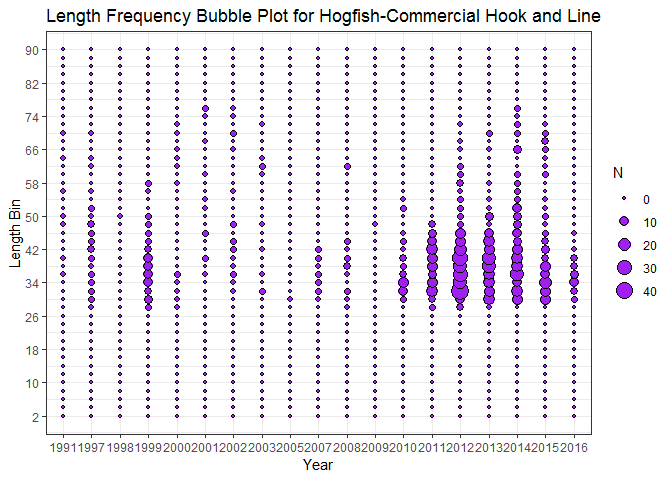
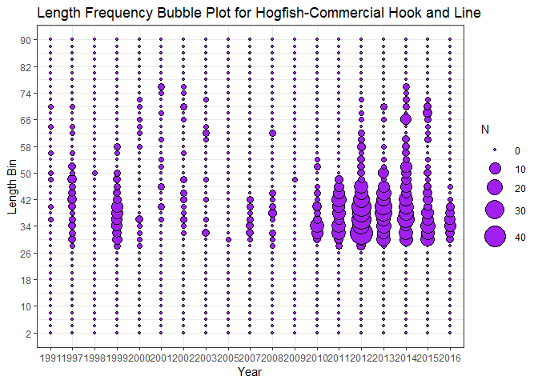

Length Frequency Bubble Plot
================
Stock Assessment Group FWRI, Liz Herdter

-   [*Main Objectives*](#main-objectives)
-   [*Start Here*](#start-here)
    -   [Define User Inputs](#define-user-inputs)
    -   [Get Data](#get-data)
    -   [Wrangle it the way the data need to be for ggplot](#wrangle-it-the-way-the-data-need-to-be-for-ggplot)
    -   [Plot it](#plot-it)

*Main Objectives*
=================

1.  Produce bubble plots describing length frequencies.

This is the resource I used to create the plots is [here.](http://t-redactyl.io/blog/2016/02/creating-plots-in-r-using-ggplot2-part-6-weighted-scatterplots.html)

*Start Here*
============

Load packages.

``` r
library(tidyverse)
```

Define User Inputs
------------------

The lowest length bin.

``` r
lbinlow=2
```

The highest length bin.

``` r
lbinhigh=90
```

How many breaks you want to have.

``` r
lbinbreaks=8
```

Specify size range for min and max if you do not like the default base size ramp.

``` r
size_range_min = 1
size_range_max= 10
```

Get Data
--------

Here is some example data from the West Florida Shelf Hogfish Update.

``` r
setwd("G:/DATA/SPECIES/HOGFISH/Hogfish_2017/AgeLength/Rexported_spreadsheets")
lengths = read.csv("WFS_LengthSS_Gear.csv", header=T)
comhl <- subset(lengths, Fleet==1) %>% select(Year, X2:X90) # subset for just 1 fleet
```

Wrangle it the way the data need to be for ggplot
-------------------------------------------------

The data are not in the right format. Right now they are just a bunch of length observations in bins..

``` r
head(comhl)
```

    ##   Year X2 X4 X6 X8 X10 X12 X14 X16 X18 X20 X22 X24 X26 X28 X30 X32 X34 X36
    ## 1 1991  0  0  0  0   0   0   0   0   0   0   0   0   0   0   0   0   0   1
    ## 2 1997  0  0  0  0   0   0   0   0   0   0   0   0   0   1   3   2   3   2
    ## 3 1998  0  0  0  0   0   0   0   0   0   0   0   0   0   0   0   0   0   0
    ## 4 1999  0  0  0  0   0   0   0   0   0   0   0   0   0   2   6   5   8   8
    ## 5 2000  0  0  0  0   0   0   0   0   0   0   0   0   0   1   1   1   1   3
    ## 6 2001  0  0  0  0   0   0   0   0   0   0   0   0   0   0   0   0   0   1
    ##   X38 X40 X42 X44 X46 X48 X50 X52 X54 X56 X58 X60 X62 X64 X66 X68 X70 X72
    ## 1   0   1   0   0   0   1   1   0   0   1   0   0   0   1   0   0   1   0
    ## 2   1   3   5   3   2   5   1   3   0   1   0   0   1   1   0   0   1   0
    ## 3   0   0   0   0   0   0   1   0   0   0   0   0   0   0   0   0   0   0
    ## 4   9   9   4   3   2   3   2   0   0   1   2   0   0   0   0   0   0   0
    ## 5   0   0   0   0   0   0   0   0   0   0   1   0   1   1   1   0   1   1
    ## 6   0   2   0   0   2   0   0   1   1   0   0   1   0   0   0   1   0   0
    ##   X74 X76 X78 X80 X82 X84 X86 X88 X90
    ## 1   0   0   0   0   0   0   0   0   0
    ## 2   0   0   0   0   0   0   0   0   0
    ## 3   0   0   0   0   0   0   0   0   0
    ## 4   0   0   0   0   0   0   0   0   0
    ## 5   0   0   0   0   0   0   0   0   0
    ## 6   1   2   0   0   0   0   0   0   0

Gather the length bins (2-90) and give them a column name and arrange by year

``` r
com_lengths <- comhl %>% gather(X2:X90, key="Length_cat", value="N") %>% arrange(Year)
head(com_lengths)
```

    ##   Year Length_cat N
    ## 1 1991         X2 0
    ## 2 1991         X4 0
    ## 3 1991         X6 0
    ## 4 1991         X8 0
    ## 5 1991        X10 0
    ## 6 1991        X12 0

The length\_cat entries are in a weird format of X2-X90. So let's make a new column called Len\_cat that only has the bin numbers. To do this remove the "x" with the gsub method.

``` r
com_lengths <- com_lengths %>%
              mutate(Len_cat = as.numeric(gsub("X", "", Length_cat))) %>%
              select(-Length_cat)


head(com_lengths)
```

    ##   Year N Len_cat
    ## 1 1991 0       2
    ## 2 1991 0       4
    ## 3 1991 0       6
    ## 4 1991 0       8
    ## 5 1991 0      10
    ## 6 1991 0      12

Last thing... Year needs to be a factor.

``` r
com_lengths$Year <- as.factor(com_lengths$Year)

str(com_lengths$Year)
```

    ##  Factor w/ 19 levels "1991","1997",..: 1 1 1 1 1 1 1 1 1 1 ...

Good! Now we are all ready to plot.

Plot it
-------

``` r
g <- ggplot(com_lengths, aes(x=Year, y=Len_cat, size=N)) + 
  geom_point(shape=21, fill="purple") + #make an empty bubble  and then fill with a color 
  scale_y_continuous(name="Length Bin", breaks = seq(lbinlow, lbinhigh, lbinbreaks))  +
  theme_bw()+
  ggtitle("Length Frequency Bubble Plot for Hogfish-Commercial Hook and Line ") 

g
```



If you want to change the size of the ramp (size of the bubbles for each level) you can do that with 'r scale\_size\_continous'.

``` r
g + scale_size_continuous(range=c(size_range_min, size_range_max)) 
```


