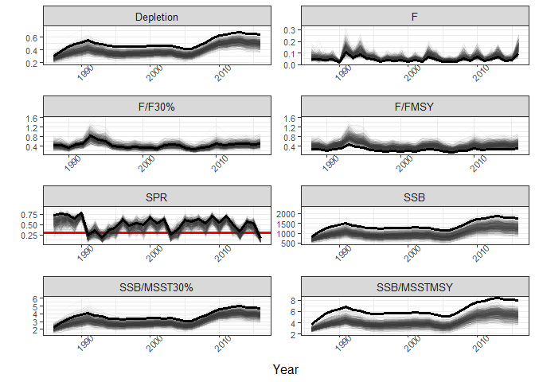

SS Bootstrap
================
Jakob Tetzlaff (modified by Michelle Masi on 11/8/2016, modified by Liz Herdter on 3/5/2018)

Main Objectives
===============

1.  Run a bootstrap analysis on the SS models (resample the data and refit the models)
2.  Visualize the results of the boostrapped models

Start Here
==========

Load packages
-------------

``` r
library(r4ss)
library(coda)
library(reshape2)
library(tidyverse)
library(RColorBrewer)
```

Define directory for base models and the bootstrapped models
------------------------------------------------------------

Define the base model and define location where the model is to be (or was already) bootstrapped. (baseinpath, inpath)

``` r
baseinpath <- "G:/DATA/SPECIES/HOGFISH/Hogfish_2017/AssessmentModel/Continuity Model/"  
inpath <- "G:/DATA/SPECIES/HOGFISH/Hogfish_2017/AssessmentModel/Continuity Model/boot_DA"   
```

***Run Boostrap ***\*
---------------------

\*\* WARNING: SKIP IF YOU'VE ALREADY RUN THIS PART: RUN ONLY ONCE, TAKES A LONG TIME!\*\*

``` r
N <- 500

setwd(inpath)

# Make copy
starter <- SS_readstarter(file="starter.ss") # read starter file
file.copy("starter.ss","starter_backup.ss")  # make backup

# Pull out the bootrap datasets 
SS_splitdat(inpath=inpath, number=TRUE, MLE=FALSE)


for(iboot in 1:N){
 
  cat("\n##### Running bootstrap model number",iboot," #########\n") 
  
  # change data file name in starter file
  starter$datfile <- paste("BootData",iboot,".ss",sep="")
  # replace starter file with modified version
  SS_writestarter(starter, overwrite=TRUE)

  # delete any old output files
  file.remove("Report.sso",paste("Report_",iboot,".sso",sep=""))
  file.remove("CompReport.sso",paste("CompReport_",iboot,".sso",sep=""))
  file.remove("covar.sso",paste("covar_",iboot,".sso",sep=""))

  # run model
#  shell("SS3")
  # for some computers or versions of R, "shell" works better than "system"
  system("ss3")

  # copy output files (might be good to use "file.exists" command first to check if they exist
  file.copy("Report.sso",paste("Report_",iboot,".sso",sep=""))
  file.copy("CompReport.sso",paste("CompReport_",iboot,".sso",sep=""))
  file.copy("covar.sso",paste("covar_",iboot,".sso",sep=""))
  # other .sso files could be copied as well
}
```

Get inputs from base model
--------------------------

``` r
setwd(baseinpath)
modSS <- SS_output(baseinpath, verbose=FALSE, printstats=FALSE)
```

    ## Correcting for bug in tag data output associated with SSv3.24f

``` r
partab <- modSS$parameters
dquant <- modSS$derived_quants
tser <- modSS$timeseries
sprser <- modSS$sprseries
```

Version issues have resulted in inconsistent naming. Change to be consistent with below code.

``` r
if ("LABEL" %in% names(dquant)) {
  dquant <- dquant %>% rename(Label = LABEL)
}

if ("Yr" %in% names(tser)) {
  tser <- tser %>% rename(Year = Yr)
}

if ("Yr" %in% names(sprser)) {
  sprser <- sprser %>% rename(Year = Yr)
}
```

Set some values
---------------

Change Mtarget, end year, define N, and define years for geometric calculation

``` r
MTarget <- 0.179 #Female - DA2016
  #from Lorenzen curve
maxYr <- 2016
N <- 500
curryears <- c('2014', '2015', '2016') 
```

Get bootstrap output and save it to an R.data file. SKIP IF THIS HAS BEEN DONE ALREADY.
---------------------------------------------------------------------------------------

``` r
setwd(inpath)
bootmodels  <- SSgetoutput(keyvec=paste("_",1:N,sep=""), dirvec=inpath)
bootsummary <- SSsummarize(bootmodels)
save(bootsummary, file="bootsummary.RData")
```

Load the bootsummary data
-------------------------

``` r
setwd(inpath)
load("bootsummary.RData")
```

Get the data
------------

Likelihood across runs.

``` r
likes=bootsummary$likelihoods; rownames(likes)=likes$Label
```

Derived quantities across runs.

``` r
quants=bootsummary$quants; rownames(quants)=quants$Label
if ("LABEL" %in% names(quants)) {
  quants <- quants %>% rename(LABEL = Label)
}
if("Yr" %in% names(quants)) {
  quants <- quants %>% rename(Year = Yr)
}
```

Estimated parameters across runs

``` r
pars=bootsummary$pars; rownames(pars)=pars$Label
if ("LABEL" %in% names(pars)) {
  pars <- pars %>% rename(LABEL = Label)
}
if("Yr" %in% names(pars)) {
  pars <- pars %>% rename(Year = Yr)
}
```

Indices across runs

``` r
indices=bootsummary$indices
```

Build some parameters
---------------------

Note: Some of these are hardcoded, some are based on maxyr and N

1.  Build geometric Fcurrent
2.  F/FMSY - this is geometric Fcurrent/FMSY
3.  F/F30% - this is geometric Fcurrent/FMSY

``` r
fcurr=quants[quants$Label %in% c("F_2014","F_2015","F_2016"),1:N]
geomean=function(x) exp(mean(log(x)))
furrgeo=apply(fcurr,2,geomean)

#F/FMSY - this is geometric Fcurrent/FMSY
f.fmsy=furrgeo/quants[quants$Label %in% c("Fstd_MSY"),1:N]
f.fmsy$Label="F/FMSY"
f.fmsy$Year=NA


#F/F30% - this is geometric Fcurrent/F30%
f.f30=furrgeo/quants[quants$Label %in% c("Fstd_SPRtgt"),1:N]
f.f30$Label="F/F30%"
f.f30$Year=NA
```

1.  SSB/SSB\_MSY
2.  MSSTMSY
3.  SSB/MSSTMSY
4.  MSST30%
5.  SSB/MSST30

``` r
#SSB/SSB_MSY
ssb.ssbmsy=quants[quants$Label %in% c("SPB_2016"),1:N]/quants[quants$Label %in% c("SSB_MSY"),1:N]
ssb.ssbmsy$Label="SSB/SSB_MSY"
ssb.ssbmsy$Year=maxYr

#MSSTMSY
msstmsy = (0.5*quants[quants$Label %in% c("SSB_MSY"),1:N])
msstmsy$Label = "MSSTMSY"
msstmsy$Year = NA

#SSB/MSSTMSY
ssb.ssbmsst=quants[quants$Label %in% c("SPB_2016"),1:N]/((0.5)*quants[quants$Label %in% c("SSB_MSY"),1:N])
ssb.ssbmsst$Label="SSB/MSSTMSY"
ssb.ssbmsst$Year=maxYr

#MSST30%
msst30 = ((0.5)*quants[quants$Label %in% c("SSB_SPRtgt"),1:N])
msst30$Label = "MSST30%"
msst30$Year = NA

#SSB/MSST30%
ssb.ssbmsst30=quants[quants$Label %in% c("SPB_2016"),1:N]/((0.5)*quants[quants$Label %in% c("SSB_SPRtgt"),1:N])
ssb.ssbmsst30$Label="SSB/MSST30%"
ssb.ssbmsst30$Year=maxYr
```

9.Depletion

``` r
deplet=quants[quants$Label %in% c("SPB_2016"),1:N]/quants[quants$Label %in% c("SPB_Virgin"),1:N]
deplet$Label="Depletion"
deplet$Year=maxYr
```

10.SPR

``` r
spr=1-quants[quants$Label %in% c("SPRratio_2016"),1:N]
spr$Label="SPR"
spr$Year=maxYr
```

1.  R0

``` r
r0=exp(pars[pars$Label %in% c("SR_LN(R0)"),1:N]) 
r0$Label="R0"
r0$Year=1986
```

Add them all together.

``` r
quants2=rbind(f.fmsy,f.f30,ssb.ssbmsy,msstmsy, ssb.ssbmsst, msst30, ssb.ssbmsst30,deplet,spr,r0)
```

Make density plots for stock status
-----------------------------------

Use `quants2` to make a `stock_status` dataframe.

``` r
stock_status = quants2[quants2$Label %in% c("F/FMSY", "SSB/MSSTMSY", "F/F30%", "SSB/MSST30%"), 1:c(N+1)]
stock_status$Label = c("F/FMSY", "F/F30%","SSB/MSSTMSY", "SSB/MSST30%")
rownames(stock_status)=stock_status$Label

#Melt it so its in ggplot expected format. 

stock_status_melt= melt(stock_status, id.vars=c("Label"), variable.name = "Iteration", value.name="Value")
stock_status_melt$Label = factor(stock_status_melt$Label, levels=c("F/FMSY", "F/F30%", "SSB/MSSTMSY", "SSB/MSST30%"))
stock_status_melt$Iteration=as.numeric(gsub(".*_","",as.character(stock_status_melt$Iteration)))   #warning here "NA's coercion" - but can ignore
```

Finally, plot.

``` r
theme_bw_extra <- function(base_size=12, base_family="") {
  gray <- "gray90"
  ret <- (theme_bw()+ theme(text=element_text(size=12),axis.text.x= element_text(size=8,angle=45),axis.text.y= element_text(size=8),plot.title = element_text(size = 10, face = "bold", colour = "black", vjust = -1)))
  ret
}

g <- ggplot(stock_status_melt, aes(x=Value)) + 
  geom_histogram(aes(y=..density..),colour="black",fill="black") + #binwidth=.5,
  #     geom_density(alpha=.2, fill="#FF6666")  +
  ylab("Density") +
  theme_bw_extra() + 
  facet_wrap(~ Label,scales = "free",nrow=2)

g
```


Write the plot out to the directory location.

``` r
windows(record=T, width=7, height=6)
g
ggsave("aaStockStatus_BootstrapPlots.png",units="in", width=6.5, height=5)  #bin warning, but still produces working plots
```

### Calculate quantiles for stock status parameters

``` r
qs=c(0.025,.25,.5,.75,.975)
qfunc <- function(x){quantile(x,qs, na.rm=T)}
meansd <- function(x) {c(mean(x,na.rm=T),sd(x,na.rm=T))}

SSTab=stock_status[,1:N]
SSTab[SSTab<0.00000000000001 | is.infinite(data.matrix(SSTab)) | is.nan(data.matrix(SSTab))]=NA
qSSTab=t(apply(SSTab,1, qfunc))
mSSTab=t(apply(SSTab,1, meansd)); colnames(mSSTab)=c("Mean","SD")
cbind(qSSTab, mSSTab)
```

    ##                  2.5%       25%       50%       75%     97.5%      Mean
    ## F/FMSY      0.3231031 0.4194664 0.4851254 0.5663576 0.7617314 0.5006550
    ## F/F30%      0.4621124 0.5922229 0.6778422 0.7773304 0.9642006 0.6848642
    ## SSB/MSSTMSY 3.8710843 4.8398489 5.3094172 5.7927926 6.5413005 5.2871121
    ## SSB/MSST30% 3.0836783 3.6192824 3.8515353 4.0889876 4.5994594 3.8583685
    ##                    SD
    ## F/FMSY      0.1171509
    ## F/F30%      0.1301665
    ## SSB/MSSTMSY 0.6930972
    ## SSB/MSST30% 0.3818026

Make density plots for biological reference points
--------------------------------------------------

``` r
ref_pt = rbind(quants[quants$Label %in% c("Fstd_MSY", "Fstd_SPRtgt"),1:c(N+1)],
               quants2[quants2$Label %in% c("MSSTMSY", "MSST30%"), 1:c(N+1)])
ref_pt$Label = c("F30%", "FMSY","MSSTMSY", "MSST30%" )
rownames(ref_pt) = ref_pt$Label

#melt so it's in ggplot expected format

ref_pt_melt= melt(ref_pt, id.vars=c("Label"), variable.name = "Iteration", value.name="Value")
ref_pt_melt$Label = factor(ref_pt_melt$Label, levels=c("F30%", "FMSY","MSSTMSY", "MSST30%" ))
ref_pt_melt$Iteration=as.numeric(gsub(".*_","",as.character(ref_pt_melt$Iteration)))   #warning here "NA's coercion" - but can ignore
```

Finally, plot

``` r
g1 <- ggplot(ref_pt_melt, aes(x=Value)) + 
  geom_histogram(aes(y=..density..),colour="black",fill="black") + #binwidth=.5,
  #     geom_density(alpha=.2, fill="#FF6666")  +
  ylab("Density") +
  theme_bw_extra() + 
  facet_wrap(~ Label,scales = "free",nrow=2)

g1
```


Write it to a file.

``` r
windows(record=T, width=7, height=6)
g1
ggsave("aaRefPts_BootstrapPlots.png",units="in", width=6.5, height=5)  #bin warning, but still produces working plots
```

### Calculate quantiles for biological reference points

``` r
RPTab=ref_pt[,1:N]
RPTab[RPTab<0.00000000000001 | is.infinite(data.matrix(RPTab)) | is.nan(data.matrix(RPTab))]=NA
qRPTab=t(apply(RPTab,1, qfunc))
mRPTab=t(apply(RPTab,1, meansd)); colnames(mRPTab)=c("Mean","SD")
cbind(qRPTab, mRPTab)
```

    ##                 2.5%          25%         50%         75%        97.5%
    ## F30%      0.09527316   0.09642778   0.0970337   0.0977255   0.09902589
    ## FMSY      0.11073247   0.12485650   0.1341070   0.1445232   0.16302570
    ## MSSTMSY 199.55405000 228.91837500 241.3525000 255.9178750 289.49006250
    ## MSST30% 272.38275000 308.14200000 329.6047500 352.4533750 401.62525000
    ##                 Mean           SD
    ## F30%      0.09706787 9.598329e-04
    ## FMSY      0.13461354 1.418392e-02
    ## MSSTMSY 242.72507800 2.204130e+01
    ## MSST30% 331.48224900 3.240867e+01

Make desinity plots for derived quantities and stock recruit parameters
-----------------------------------------------------------------------

``` r
gdVals=rbind(quants[quants$Label %in% c("SPB_Virgin","SPB_2016","TotYield_MSY"),1:c(N+1)],
  #     quants2[quants2$Label %in% c("F/F_MSY","F/F30%","SSB/SSB_MSST(MSY)","SSB/SSB_MSST(30%)","SPR","R0"),1:c(N+1)],
  quants2[quants2$Label %in% c("SPR","R0"),1:c(N+1)],
  pars[pars$Label %in% c("SR_BH_steep"),1:c(N+1)])  
#gdVals$Label=c("SPB_Virgin","SPB_2012","F_MSY","F30%","MSY","F/F_MSY","F/F30%","SSB/SSB_MSST(MSY)","SSB/SSB_MSST(30%)","SPR","R0","Steepness") 
gdVals$Label=c("SPB_Virgin","SPB_2016","MSY","SPR","R0","Steepness") 


#melt
gdValsLong=melt(gdVals,id.vars=c("Label"),variable.name="Iteration", value.name="Value")
gdValsLong$Label=factor(gdValsLong$Label,levels=c("SPB_Virgin","SPB_2016","MSY","SPR","R0","Steepness"))
gdValsLong$Iteration=as.numeric(gsub(".*_","",as.character(gdValsLong$Iteration)))   #warning here "NA's coercion" - but can ignore
```

Finally, plot.

``` r
g2 <- ggplot(gdValsLong, aes(x=Value)) + 
  geom_histogram(aes(y=..density..),colour="black",fill="black") + 
  ylab("Density") +
  theme_bw_extra() + 
  facet_wrap(~ Label,scales = "free",nrow=4)

g2
```


Write it to a file if you want.

``` r
windows(record=T, width=7, height=6)
g2
ggsave("aaDerivedquants_SR_BootstrapPlots.png",units="in", width=6.5, height=5)  #bin warning, but still produces working plots
```

### Calculate quantiles for derived quantities and stock recruit parameters

``` r
qs=c(0.025,.25,.5,.75,.975)
qfunc <- function(x){quantile(x,qs, na.rm=T)}
meansd <- function(x) {c(mean(x,na.rm=T),sd(x,na.rm=T))}
# 
#N is hard-coded here
gdValsTab=gdVals[,1:N]
gdValsTab[gdValsTab<0.00000000000001 | is.infinite(data.matrix(gdValsTab)) | is.nan(data.matrix(gdValsTab))]=NA
qgdValsTab=t(apply(gdValsTab,1, qfunc))
mgdValsTab=t(apply(gdValsTab,1, meansd)); colnames(mgdValsTab)=c("Mean","SD")
cbind(qgdValsTab, mgdValsTab)
```

    ##                       2.5%          25%          50%          75%
    ## SPB_Virgin    2.189353e+03 2.407500e+03 2534.5150000 2701.1225000
    ## SPB_2016      9.240256e+02 1.135115e+03 1269.4850000 1419.3150000
    ## TotYield_MSY  5.822563e+01 6.516558e+01   70.2166500   75.3702500
    ## SPRratio_2016 5.381122e-02 9.003525e-02    0.1304185    0.1838980
    ## SR_LN(R0)     3.689515e+02 4.057136e+02  427.1200121  455.1968713
    ## SR_BH_steep   7.729432e-01 8.037740e-01    0.8222615    0.8379787
    ##                      97.5%         Mean           SD
    ## SPB_Virgin    3058.4607500 2556.7873200 218.54029344
    ## SPB_2016      1722.8652500 1282.9963580 205.66568632
    ## TotYield_MSY    86.3564700   70.7607126   7.27548475
    ## SPRratio_2016    0.2938129    0.1443780   0.06918590
    ## SR_LN(R0)      515.4141518  430.8726930  36.82862999
    ## SR_BH_steep      0.8635972    0.8201784   0.02483624

Make timeseries plots with base model and then bootstrapped quantities
----------------------------------------------------------------------

### Base model timeseries

Get base model quantities for each year of the model to make a timeseries.

Base Model Fmsy, F30%, Fs

``` r
BFmsy=c(t(dquant[dquant$Label %in% c("Fstd_MSY"),"Value"]))
BF30=c(t(dquant[dquant$Label %in% c("Fstd_SPRtgt"),"Value"]))
BFs=dquant[grep("F_", dquant$Label ),c("Label","Value")]

BFs$Year=as.numeric(gsub("F_","",as.character(BFs$Label)))
BFs=BFs[BFs$Year> 1985 & BFs$Year <=maxYr,]  #base model start year is hard-coded here
BFs$type = "F"
```

Base Model Fcurrent

``` r
BFcurrs=BFs[BFs$Year %in% c(curryears), "Value"]  #years over which to express are hard-coded here
BFcurrgeo=geomean(BFcurrs)
BFcurr.Fmsy=BFcurrgeo/BFmsy
BFcurr.F30=BFcurrgeo/BF30
```

Base Model F/Fmsy

``` r
BF.Fmsy=BFs

BF.Fmsy$Value=BFs$Value/BFmsy
BF.Fmsy$type="F/FMSY"
```

Base Model F/F30%

``` r
BF.F30=BFs
BF.F30$Value=BFs$Value/BF30
```

Base Model Fcurr/Fmsy. Must make a moving average of F/Fmsy with Fcurrent. Parts of this are hardcoded.

``` r
Year = 1988:maxYr
BFcurr_time <- as.data.frame(matrix(data=NA, ncol=1, nrow=29)) #hard coded nrow=number of years
colnames(BFcurr_time) <- "Value"
row=1
for (i in 3:length(BFs[,1])){ #starting at the 3rd row because we need the last 2 years to join in to make geometric mean F
  bfcr = rbind(BFs[(i)-2,2], BFs[(i)-1,2], BFs[i,2])
  geomean=function(x) exp(mean(log(x)))
  Fgeom = apply(bfcr,2, geomean)
  BFcurr_time[row,] <- Fgeom
  row=row+1
}

BFcurr_time.Fmsy=BFcurr_time/BFmsy
BFcurr_time.Fmsy$type="F/FMSY"
BFcurr_time.Fmsy = cbind(Year, BFcurr_time.Fmsy)

BFcurr_time.F30=BFcurr_time/BF30
BFcurr_time.F30$type="F/F30%"
BFcurr_time.F30 = cbind(Year, BFcurr_time.F30)
```

Base Model MSST

``` r
BMSST=c(t((0.5)*dquant[dquant$Label %in% c("SSB_MSY"),"Value"]))
```

Base Model MSST30%

``` r
BMSST2=c(t((0.5)*dquant[dquant$Label %in% c("SSB_SPRtgt"),"Value"]))
```

Base Model SSB/MSST

``` r
BSPB=dquant[grep("SPB_", dquant$Label ),c("Label","Value")]


BSPB$Year=as.numeric(gsub("SPB_","",as.character(BSPB$Label)))
```

    ## Warning: NAs introduced by coercion

``` r
BSPB=BSPB[BSPB$Year>1985 & BSPB$Year<=maxYr,]   #year of BSPB is hard-coded here

BSPB=BSPB[!is.na(BSPB$Year),]
BSPB$type="SSB"

BSSB.MSST=BSPB
BSSB.MSST$Value=BSPB$Value/BMSST
BSSB.MSST$type="SSB/MSSTMSY"
```

Base Model SSB/MSST30%

``` r
BSSB.MSST2=BSPB
BSSB.MSST2$Value=BSPB$Value/BMSST2
BSSB.MSST2$type="SSB/MSST30%"
```

Base Model SPR

``` r
BSPR=sprser[,c("Year","spr")]
BSPR$type="SPR"
names(BSPR)[1:2]=c("Year","Value")
BSPR=BSPR[BSPR$Year>1985 & BSPR$Year<=maxYr,]   #year hard-coded here
```

Base Model Depletion

``` r
BDepl=sprser[,c("Year","Deplete")]
BDepl$type="Depletion"
names(BDepl)[1:2]=c("Year","Value") 
BDepl=BDepl[BDepl$Year>1985 & BDepl$Year<=maxYr,]   #year hard-coded here
```

### Bootstrapped model timeseries

``` r
Fmsys=c(t(quants[quants$Label %in% c("Fstd_MSY"),1:N]))
F30=c(t(quants[quants$Label %in% c("Fstd_SPRtgt"),1:N]))
mssts=c(t((0.5)*quants[quants$Label %in% c("SSB_MSY"),1:N]))
mssts2=c(t((0.5)*quants[quants$Label %in% c("SSB_SPRtgt"),1:N]))


biom=bootsummary$SpawnBio
biom$type="SSB"
biom <- biom %>% rename(Year=Yr)

Fs=quants[grep("F_", quants$Label ),]
Fs$type="F"

FFmsy=Fs
BBmsst=biom
FF30=Fs
BBmsst2=biom
```

Build moving average style Fcurr - WARNING-HARD CODING HERE

``` r
Fcurr_boot <- data.frame(matrix(data=NA, ncol=500, nrow=49)) #hard coded nrow=number of years
F_trim = Fs[,1:500] #these are the Fs from the bootstrap
row=1
for (i in 3:length(F_trim[,1])){ #starting at the 3rd row because we need the last 2 years to join in to make geometric mean F
Fcurr_trim = rbind(F_trim[i-2,], F_trim[i-1,], F_trim[i,])
geomean=function(x) exp(mean(log(x)))
Fgeom = apply(Fcurr_trim,2, geomean)
Fcurr_boot[row,] <- Fgeom
row=row+1
}
```

use new Fcurr in F/Fmsy, F/f30 calculations - WARNING-HARD CODING HERE

``` r
FFmsy =data.frame(matrix(data=NA, ncol=500, nrow=49)) #nrow hard coded from number of years with new geometric F
FF30=data.frame(matrix(data=NA, ncol=500, nrow=49)) 
for (i in 1:length(Fcurr_boot[,1])) {
  for (j in 1:N) {
    FFmsy[i,j] =Fcurr_boot[i,j]/Fmsys[j]
    FF30[i,j]=Fcurr_boot[i,j]/Fmsys[j]
    BBmsst2[i+2,j]=biom[i+2,j]/mssts2[j]
    BBmsst[i+2,j]=biom[i+2,j]/mssts[j]
  }
}

FFmsy$Label = "F/FMSY"
FFmsy$Year = 1988:2036
FFmsy$type="F/FMSY"
colnames(FFmsy)=colnames(biom)
BBmsst$type="SSB/MSSTMSY"
FF30$Label="F/F30%"
FF30$Year= 1988:2036
FF30$type="F/F30%"
colnames(FF30)=colnames(biom)
BBmsst2$type="SSB/MSST30%"
```

Depletion

``` r
depl=bootsummary$Bratio
depl$type="Depletion"

depl <- depl %>% rename(Year=Yr)
```

SPR

``` r
spr=bootsummary$SPRratio
spr[,1:N]=1-spr[,1:N]       #N is hard-coded here
spr$type="SPR"

spr <- spr %>% rename(Year=Yr)
sprtemp=t(spr[spr$Year==maxYr,1:N])     #end year and N are hard-coded here
```

Combine all together and melt to make good ggplot format.

``` r
comb=rbind(biom,Fs,FFmsy,FF30,BBmsst,BBmsst2,depl,spr)
#comb = rbind(Fs,FFmsy,FF30,BBmsst,BBmsst2,depl,spr)
comb_min=comb[comb$Year>1985 & comb$Year<=maxYr,]     #start year is hard-coded here

comb_min$type=factor(comb_min$type, levels=c("F","SSB","Depletion","SPR", "F/F30%", "F/FMSY", "SSB/MSSTMSY" , "SSB/MSST30%"))

combLong=melt(comb_min,id.vars=c("Label","Year","type"),variable.name="Iteration", value.name="Value")
combLong$Iteration=as.numeric(gsub(".*_","",as.character(combLong$Iteration))) 
```

Finally, plot.

``` r
g4 <- ggplot(combLong,aes(x = Year,y = Value)) +    
  geom_hline(aes(yintercept = .3),color="red",size=1.2,data=subset(combLong,type == "SPR")) + 
  #geom_hline(aes(yintercept = .35),color="red",size=1.2,data=subset(combLong,type == "SPR")) + 
  #geom_hline(aes(yintercept = .4),color="red",size=1.2,data=subset(combLong,type == "SPR")) + 
  geom_line(aes(group=Iteration), color="gray20",alpha=.05, size=0.2) + #geom_point() + 
  scale_y_continuous("") +  #, limits=c(0,750000),labels=comma
  theme_bw_extra() + 
  facet_wrap(~type, scales = "free", nrow=4)

g4
```


Now add the base model timeseries data. This is possible because each of these df have the variable name `type` which the plot is being faceted by so these lines will go on the correct plot.

``` r
g4 + geom_line(data=BFs,size=1.2) +
  geom_line(data=BSPB,size=1.2) + #geom_point() + 
  geom_line(data=BFcurr_time.Fmsy,size=1.2) + #geom_point() + 
  geom_line(data=BFcurr_time.F30,size=1.2) + #geom_point() + 
  geom_line(data=BSSB.MSST,size=1.2) + #geom_point() + 
    geom_line(data=BSSB.MSST2,size=1.2) + #geom_point() + 
  geom_line(data=BSPR,size=1.2) + #geom_point() + 
  geom_line(data=BDepl,size=1.2) 
```



Write the file if you want.

``` r
ggsave("BaseModel_Compare for BootstrapPlots.png",units="in", width=6, height=6)
```
